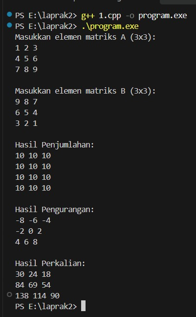
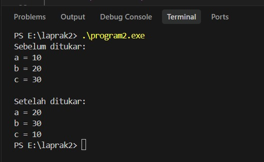
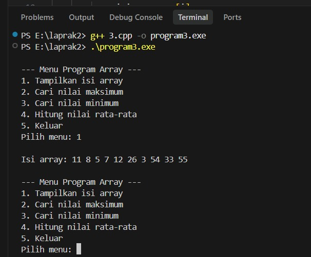
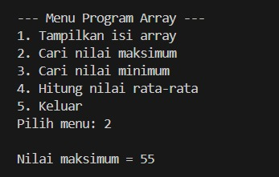
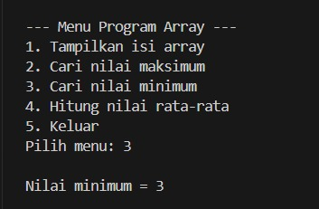
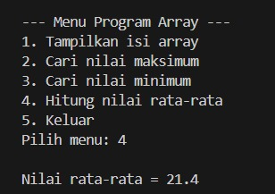
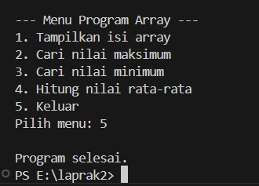

# <h1 align="center">Modul 2  PENGENALAN BAHASA C++ (BAGIAN KEDUA) </h1>
<p align="center">Muh. Dzaky Luthfi - 109082530015</p>

## Dasar Teori

### A. Array

Array merupakan kumpulan data yang memiliki nama yang sama dan setiap elemennya memiliki tipe data yang sama. Setiap elemen pada array dapat diakses berdasarkan indeksnya. Dalam bahasa C++, indeks array dimulai dari 0 sehingga elemen pertama memiliki indeks 0, sedangkan elemen berikutnya memiliki indeks 1 dan seterusnya.

Array dapat dibedakan berdasarkan jumlah dimensinya, yaitu array satu dimensi, array dua dimensi, dan array berdimensi banyak. Array satu dimensi hanya memiliki satu larik data, sedangkan array dua dimensi dapat digunakan untuk menyimpan data dalam bentuk tabel karena memiliki dua indeks. Array berdimensi banyak memiliki lebih dari dua indeks yang menunjukkan dimensi dari array tersebut.

### B. Pointer dan Alamat Memori

Semua data yang digunakan oleh program komputer disimpan di dalam memori atau RAM. Setiap lokasi pada memori memiliki alamat yang unik yang digunakan sebagai identitas lokasi penyimpanan data. Ketika sebuah variabel dideklarasikan, sistem operasi akan mengalokasikan ruang memori untuk menyimpan variabel tersebut.

Alamat memori suatu variabel dapat diketahui menggunakan operator `&` yang ditempatkan di depan nama variabel. Pointer merupakan variabel yang digunakan untuk menyimpan alamat memori dari variabel lain. Dengan pointer, nilai dari variabel yang ditunjuk dapat diakses menggunakan operator `*`.

Pointer juga memiliki ruang memori dan alamatnya sendiri karena pointer merupakan sebuah variabel. Pointer dapat digunakan untuk menunjuk variabel dengan tipe data tertentu, misalnya `int *p_int` merupakan pointer yang digunakan untuk menunjuk data bertipe integer.

### C. Pointer dan Array

Array memiliki hubungan yang erat dengan pointer. Pointer dapat digunakan untuk menunjuk alamat elemen tertentu pada array. Sebagai contoh, `pa = &a[0]` membuat pointer `pa` menunjuk ke alamat elemen pertama array `a`. Nilai elemen yang ditunjuk dapat diperoleh menggunakan operator dereference `*`.

Pointer juga dapat digunakan untuk melakukan perpindahan antar-elemen array. Jika pointer menunjuk ke elemen pertama array, maka `pa + 1` akan menunjuk ke elemen berikutnya. Secara umum, `pa + i` merupakan alamat dari elemen `a[i]`, sedangkan `*(pa + i)` digunakan untuk mendapatkan nilai dari elemen tersebut.

### D. Pointer dan String

String merupakan bentuk data yang digunakan untuk mengolah data berupa teks atau kalimat. Dalam bahasa C++, string pada dasarnya merupakan kumpulan karakter atau array karakter. String dapat dideklarasikan menggunakan array karakter, misalnya `char nama[50]`, dengan ukuran array menunjukkan jumlah maksimum karakter yang dapat disimpan.

Untuk membaca string, `cin` hanya membaca karakter sampai menemukan spasi. Untuk membaca seluruh baris termasuk spasi, dapat digunakan `getline()`. String juga diakhiri dengan karakter null `'\0'` yang digunakan untuk menunjukkan akhir dari string.

### E. Fungsi

Fungsi merupakan blok kode yang dirancang untuk melaksanakan tugas tertentu. Penggunaan fungsi membuat program menjadi lebih terstruktur karena program dapat dibagi menjadi beberapa modul yang lebih kecil. Selain itu, fungsi dapat mengurangi pengulangan kode atau duplikasi kode sehingga ukuran program menjadi lebih efisien.

Pada umumnya, fungsi dapat menerima masukan berupa parameter yang kemudian diolah untuk menghasilkan suatu nilai balik. Bentuk umum fungsi dalam C++ adalah tipe keluaran, nama fungsi, daftar parameter, dan blok pernyataan fungsi.

### F. Prosedur

Prosedur dalam bahasa C++ merujuk pada fungsi yang tidak mengembalikan nilai. Prosedur dikenal sebagai fungsi dengan tipe `void`. Fungsi tersebut digunakan untuk melakukan tugas tertentu tanpa memberikan nilai balik kepada pemanggilnya.

Bentuk umum prosedur adalah `void` yang diikuti nama prosedur dan daftar parameter. Pernyataan-pernyataan yang terdapat di dalam prosedur akan dijalankan ketika prosedur tersebut dipanggil dari program utama.

### G. Parameter Fungsi

Parameter pada fungsi terdiri atas parameter formal dan parameter aktual. Parameter formal merupakan variabel yang terdapat pada daftar parameter ketika sebuah fungsi didefinisikan. Sementara itu, parameter aktual merupakan nilai atau argumen yang digunakan ketika fungsi dipanggil. Parameter aktual dapat berupa variabel, konstanta, maupun suatu ungkapan.

Dalam C++, parameter dapat dilewatkan dengan beberapa cara, yaitu pemanggilan dengan nilai (*call by value*), pemanggilan dengan pointer (*call by pointer*), dan pemanggilan dengan referensi (*call by reference*).

#### 1. Call by Value

Pada *call by value*, nilai dari parameter aktual disalin ke dalam parameter formal. Oleh karena itu, perubahan yang terjadi pada parameter formal di dalam fungsi tidak mengubah nilai parameter aktual yang berada di luar fungsi.

#### 2. Call by Pointer

Pada *call by pointer*, alamat suatu variabel dilewatkan ke dalam fungsi menggunakan pointer. Dengan cara ini, fungsi dapat mengubah nilai variabel aktual yang berada di luar fungsi. Pemanggilan fungsi dilakukan dengan melewatkan alamat variabel menggunakan operator `&`.

#### 3. Call by Reference

Pada *call by reference*, alamat suatu variabel dilewatkan ke dalam fungsi melalui parameter referensi. Cara ini memungkinkan fungsi mengubah nilai variabel aktual yang berada di luar fungsi. Pada parameter fungsi digunakan tanda `&`, sedangkan ketika fungsi dipanggil tidak diperlukan operator tambahan seperti pada *call by pointer*.
## Guided 

### 1. Program Array 1

```C++
#include <iostream>
using namespace std;

int main() {
    int nilai[5];

    nilai[0] = 80;
    nilai[1] = 85;
    nilai[2] = 90;
    nilai[3] = 75;
    nilai[4] = 95;

    for (int i = 0; i < 5; i++) {
        cout << nilai[i] << endl;
    }

    return 0;
}

```
Program ini merupakan contoh sederhana penggunaan array satu dimensi dalam bahasa C++. Array yang digunakan bernama nilai dengan tipe data int dan berukuran 5 elemen. Setiap elemen array kemudian diisi dengan nilai secara manual, yaitu 80, 85, 90, 75, dan 95 pada indeks 0 hingga 4.

Selanjutnya, program menampilkan seluruh isi array menggunakan perulangan for. Perulangan dimulai dari indeks 0 hingga indeks 4, dan pada setiap iterasi nilai array dicetak ke layar diikuti dengan perpindahan baris (endl). Hasil akhir dari program ini adalah tampilan lima nilai berurutan ke bawah, yaitu 80, 85, 90, 75, dan 95.

Secara keseluruhan, program ini bertujuan untuk memperlihatkan cara mendeklarasikan array, mengisi elemennya, dan menampilkan isinya menggunakan struktur perulangan dalam C++.

### 2. Program Array 2

```C++
#include <iostream>
using namespace std;

int main() {
    int nilai[3][3] = {
    {80, 85, 90},
    {75, 80, 85},
    {90, 95, 100}
};

    for (int i = 0; i < 3; i++) {
        for (int j = 0; j < 3; j++) {
            cout << nilai[i][j] << " ";
        }
        cout << endl;
    }

    return 0;
}
```
Program ini merupakan contoh penggunaan array dua dimensi dalam C++ untuk menyimpan data berbentuk matriks 3×3. Array nilai diisi langsung dengan sembilan nilai integer saat dideklarasikan. Selanjutnya, program menampilkan seluruh isi array menggunakan perulangan bersarang, di mana loop luar mengatur baris dan loop dalam mengatur kolom. Hasil akhirnya adalah tampilan data dalam format matriks 3 baris dan 3 kolom, sehingga program ini menggambarkan cara dasar menginisialisasi dan menampilkan array dua dimensi di C++.

### 3. Program Array Banyak

```C++
#include <iostream>
using namespace std;

int main() {
    int data[2][2][2][2] = {
        {
            {
                {1, 2},
                {3, 4}
            },
            {
                {5, 6},
                {7, 8}
            }
        },
        {
            {
                {9, 10},
                {11, 12}
            },
            {
                {13, 14},
                {15, 16}
            }
        }
    };

    cout << data[0][0][0][0] << endl; // 1
    cout << data[1][1][1][1] << endl; // 16

    return 0;
}
```
Program ini merupakan contoh penggunaan array multidimensi empat dimensi dalam bahasa C++. Array bernama data dideklarasikan dengan ukuran [2][2][2][2], sehingga total elemen yang dimilikinya adalah 16 (2 × 2 × 2 × 2). Array tersebut langsung diinisialisasi dengan nilai integer 1 sampai 16 yang tersusun secara berurutan dalam struktur bersarang.

Selanjutnya, program mengakses dua elemen tertentu dari array, yaitu elemen pertama melalui indeks data[0][0][0][0] yang bernilai 1, dan elemen terakhir melalui indeks data[1][1][1][1] yang bernilai 16. Kedua nilai tersebut kemudian ditampilkan ke layar menggunakan cout.

Secara keseluruhan, program ini bertujuan untuk memperlihatkan cara mendeklarasikan, menginisialisasi, dan mengakses elemen array multidimensi (4 dimensi) di C++ menggunakan indeks bertingkat.

### 4. Program Pointer 1

```C++
#include <iostream>
using namespace std;

int main() {
    char a;
    int j;
    char arr[6];

    arr[3] = 'b';
    a = 'u';

    cout << a << endl;
    cout << &a << endl;
    cout << j << endl;
    cout << &j << endl;

    cout << &(arr[4]) << endl;

    return 0;
    
}
```
Program ini adalah contoh dasar penggunaan operator alamat (&) dalam C++, yang merupakan konsep awal dari pointer. Program mendeklarasikan variabel a (char), j (int), dan array arr[6], lalu mengisi sebagian nilainya. Program kemudian menampilkan nilai dan alamat memori dari variabel tersebut menggunakan cout. Operator & berfungsi mengambil alamat memori suatu variabel — alamat inilah yang nantinya disimpan oleh sebuah pointer. Khusus variabel bertipe char, alamat memorinya ditampilkan sebagai karakter acak karena cout memperlakukannya sebagai string. Variabel j yang tidak diinisialisasi juga menunjukkan munculnya garbage value. Secara keseluruhan, program ini memperkenalkan konsep alamat memori dan pointer secara sederhana.

### 5. Program Pointer 2

```C++
#include <iostream>
using namespace std;

int main() {
    int x, y;
    int *px;

    x = 87;
    px = &x;
    y = *px;

    cout << "Alamat x= " << &x << endl;
    cout << "Isi px= " << px << endl;
    cout << "Isi X= " << x << endl;
    cout << "Nilai yang ditunjuk px= " << *px << endl;
    cout << "Nilai y= " << y << endl;

    return 0;
}
```
Program ini merupakan contoh dasar penggunaan pointer dalam bahasa C++. Terdapat tiga variabel yang dideklarasikan, yaitu x dan y bertipe int, serta px bertipe int* (pointer ke integer). Variabel x diisi nilai 87, kemudian pointer px diarahkan ke alamat memori x menggunakan operator &. Selanjutnya, nilai yang ditunjuk oleh px diakses dengan operator * dan disalin ke variabel y, sehingga y juga bernilai 87.

Program kemudian menampilkan beberapa informasi ke layar, yaitu alamat memori x (&x), isi pointer px (yang sama dengan alamat x), nilai x, nilai yang ditunjuk px (*px), dan nilai y. Semua output nilai menunjukkan angka 87, sedangkan output alamat berupa kode heksadesimal.

Secara keseluruhan, program ini bertujuan untuk memperkenalkan konsep pointer, yaitu variabel yang menyimpan alamat memori variabel lain, serta cara mengakses nilai melalui pointer menggunakan operator & (address-of) dan * (dereference).

### 6. Program Pointer 3

```C++
#include <iostream>
#define MAX 5
using namespace std;

int main() {
    int i, j;
    float nilai_total, rata_rata;
    float nilai[MAX];

    static int nilai_tahun[MAX][MAX] = {
        {0, 2, 2, 0, 0},
        {0, 1, 1, 1, 0},
        {0, 3, 3, 3, 0},
        {4, 4, 0, 0, 4},
        {5, 0, 0, 0, 5}
    };

    for (i = 0; i < MAX; i++) {
        cout << "masukkan nilai ke-" << i + 1 << endl;
        cin >> nilai[i];
    }

    cout << "\ndata nilai siswa :\n";

    for (i = 0; i < MAX; i++)
        cout << "nilai k-" << i + 1 << "=" << nilai[i] << endl;

    cout << "\n nilai tahunan : \n";

    for (i = 0; i < MAX; i++) {
        for (j = 0; j < MAX; j++)
            cout << nilai_tahun[i][j];
        cout << "\n";
    }

    return 0;
}
```
Program ini merupakan contoh penggunaan array satu dimensi dan dua dimensi dalam C++ dengan konstanta MAX bernilai 5. Program mendeklarasikan array nilai[5] untuk menyimpan 5 nilai float yang diinput oleh pengguna, serta array nilai_tahun[5][5] yang sudah diinisialisasi dengan nilai tertentu. Setelah input, program menampilkan kembali data array satu dimensi dalam format berurutan, kemudian menampilkan isi array dua dimensi dalam bentuk matriks 5×5 menggunakan perulangan bersarang. Program ini bertujuan untuk memperlihatkan cara mendeklarasikan, mengisi, dan menampilkan array satu dan dua dimensi di C++.

### 7. Program Pointer 4

```C++
#include <iostream>
using namespace std;

int main() {
    char nama[] = "strukdat";

    cout << nama << endl;
    cout << nama[3] << endl;

    return 0;
}
```
Program ini merupakan contoh sederhana penggunaan array karakter (string) dalam C++. Array nama diinisialisasi dengan kata "strukdat", lalu program menampilkan seluruh isi array tersebut menggunakan cout. Selanjutnya, program juga menampilkan satu karakter tertentu, yaitu karakter pada indeks ke-3 (nama[3]), yang bernilai 'u'. Program ini bertujuan untuk memperlihatkan cara mendeklarasikan string, menampilkan string secara utuh, dan mengakses elemen karakter tertentu berdasarkan indeksnya.

### 8. Program Fungsi

```C++
#include <iostream>
using namespace std;

int maks3(int a, int b, int c);

int main() {
    int x, y, z;
    cout << "masukkan nilai bilangan ke-1 = ";
    cin >> x;
    cout << "masukkan nilai bilangan ke-2 =";
    cin >> y;
    cout << "masukkan nilai bilangan ke-3 =";
    cin >> z;
    cout << "nilai maksimumnya adalah = " << maks3(x, y, z);
    return 0;
}

int maks3(int a, int b, int c) {
    int temp_max = a;
    if (b > temp_max)
        temp_max = b;
    if (c > temp_max)
        temp_max = c;
    return (temp_max);
}
```
Program ini merupakan contoh penggunaan fungsi (function) dalam C++ untuk mencari nilai maksimum dari tiga bilangan. Program terdiri dari fungsi main sebagai program utama dan fungsi maks3 sebagai fungsi pembantu. Pengguna diminta memasukkan tiga bilangan, kemudian fungsi maks3 membandingkan ketiganya menggunakan pernyataan if dan mengembalikan nilai yang paling besar. Hasil akhirnya ditampilkan ke layar. Program ini bertujuan untuk memperlihatkan cara membuat dan memanggil fungsi, serta penggunaan parameter dan nilai kembalian (return value) dalam C++.

### 9. Program Procedure

```C++
#include <iostream>
using namespace std;

void tulis(int x);

int main() {
    int jum;
    cout << "jumlah baris kata = ";
    cin >> jum;
    tulis(jum);
    return 0;
}

void tulis(int x) {
    for (int i = 0; i < x; i++)
        cout << "baris ke-" << i + 1 << endl;
}
```
Program ini merupakan contoh penggunaan prosedur (fungsi void) dalam C++. Program terdiri dari fungsi main sebagai program utama dan fungsi tulis sebagai prosedur pembantu. Pengguna diminta memasukkan jumlah baris, kemudian prosedur tulis mencetak teks "baris ke-n" sebanyak jumlah yang dimasukkan menggunakan perulangan for. Karena fungsi tulis bertipe void, fungsi ini hanya menjalankan perintah tanpa mengembalikan nilai. Program ini bertujuan untuk memperlihatkan cara membuat dan memanggil prosedur, serta perbedaan antara fungsi yang mengembalikan nilai dan prosedur (void) dalam C++.


## Unguided 

### 1. Buatlah program yang dapat melakukan operasi penjumlahan, pengurangan, dan perkalian matriks 3x3 

```C++
#include <iostream>
using namespace std;

int main() {
    int A[3][3], B[3][3];
    int tambah[3][3], kurang[3][3], kali[3][3];

    
    cout << "Masukkan elemen matriks A (3x3):\n";
    for (int i = 0; i < 3; i++) {
        for (int j = 0; j < 3; j++) {
            cin >> A[i][j];
        }
    }


    cout << "\nMasukkan elemen matriks B (3x3):\n";
    for (int i = 0; i < 3; i++) {
        for (int j = 0; j < 3; j++) {
            cin >> B[i][j];
        }
    }

    
    for (int i = 0; i < 3; i++) {
        for (int j = 0; j < 3; j++) {
            tambah[i][j] = A[i][j] + B[i][j];
            kurang[i][j] = A[i][j] - B[i][j];
        }
    }

    
    for (int i = 0; i < 3; i++) {
        for (int j = 0; j < 3; j++) {
            kali[i][j] = 0;

            for (int k = 0; k < 3; k++) {
                kali[i][j] += A[i][k] * B[k][j];
            }
        }
    }

    cout << "\nHasil Penjumlahan:\n";
    for (int i = 0; i < 3; i++) {
        for (int j = 0; j < 3; j++) {
            cout << tambah[i][j] << " ";
        }
        cout << endl;
    }


    cout << "\nHasil Pengurangan:\n";
    for (int i = 0; i < 3; i++) {
        for (int j = 0; j < 3; j++) {
            cout << kurang[i][j] << " ";
        }
        cout << endl;
    }


    cout << "\nHasil Perkalian:\n";
    for (int i = 0; i < 3; i++) {
        for (int j = 0; j < 3; j++) {
            cout << kali[i][j] << " ";
        }
        cout << endl;
    }

    return 0;
}
```
### Output Unguided 1 :

##### Output 1


Program C++ tersebut digunakan untuk melakukan operasi dasar pada dua matriks berukuran 3×3, yaitu penjumlahan, pengurangan, dan perkalian matriks. Program terlebih dahulu meminta pengguna memasukkan seluruh elemen matriks A dan matriks B menggunakan perulangan for bersarang.

Setelah data dimasukkan, program melakukan penjumlahan dan pengurangan dengan menjumlahkan atau mengurangkan elemen matriks A dan B yang memiliki posisi indeks yang sama. Selanjutnya, program melakukan perkalian matriks menggunakan tiga perulangan for, dengan setiap elemen hasil diperoleh dari penjumlahan perkalian elemen pada baris matriks A dengan kolom matriks B.

Hasil dari ketiga operasi tersebut kemudian ditampilkan ke layar dalam bentuk matriks menggunakan perulangan for. Program menggunakan array dua dimensi untuk menyimpan elemen matriks.

### 2. Berdasarkan guided pointer dan reference sebelumnya, buatlah keduanya dapat menukar nilai dari 3 variabel 

```C++
#include <iostream>
using namespace std;

void tukar(int *a, int *b, int *c) {
    int temp;

    temp = *a;
    *a = *b;
    *b = *c;
    *c = temp;
}

int main() {
    int a = 10, b = 20, c = 30;

    cout << "Sebelum ditukar:" << endl;
    cout << "a = " << a << endl;
    cout << "b = " << b << endl;
    cout << "c = " << c << endl;

    tukar(&a, &b, &c);

    cout << "\nSetelah ditukar:" << endl;
    cout << "a = " << a << endl;
    cout << "b = " << b << endl;
    cout << "c = " << c << endl;

    return 0;
}
```
### Output Unguided 2 :

##### Output 2


Program C++ tersebut digunakan untuk menukar nilai tiga variabel a, b, dan c menggunakan pointer. Fungsi tukar() menerima alamat dari ketiga variabel melalui parameter pointer int *a, int *b, dan int *c.

Di dalam fungsi, variabel temp digunakan sebagai penyimpanan sementara untuk memindahkan nilai. Nilai a dipindahkan ke b, nilai b dipindahkan ke c, kemudian nilai awal a yang disimpan pada temp dipindahkan ke c. Pemanggilan fungsi menggunakan operator & untuk mengirimkan alamat variabel.

Program menampilkan nilai a, b, dan c sebelum dan setelah proses pertukaran sehingga dapat terlihat bahwa perubahan nilai dilakukan langsung pada variabel asli melalui pointer atau call by pointer.

### 3. Diketahui sebuah array 1 dimensi sebagai berikut :  arrA = {11, 8, 5, 7, 12, 26, 3, 54, 33, 55} Buatlah program yang dapat mencari nilai minimum, maksimum, dan rata – rata dari array tersebut! Gunakan function cariMinimum() untuk mencari nilai minimum dan function cariMaksimum() untuk mencari nilai maksimum, serta gunakan prosedur hitungRataRata() untuk menghitung nilai rata – rata! Buat program menggunakan menu switch-case seperti berikut ini : --- Menu Program Array --- 1. Tampilkan isi array 2. cari nilai maksimum 3. cari nilai minimum 4. Hitung nilai rata - rata 
```C++
#include <iostream>
using namespace std;


int cariMinimum(int arr[], int n) {
    int minimum = arr[0];

    for (int i = 1; i < n; i++) {
        if (arr[i] < minimum) {
            minimum = arr[i];
        }
    }

    return minimum;
}

int cariMaksimum(int arr[], int n) {
    int maksimum = arr[0];

    for (int i = 1; i < n; i++) {
        if (arr[i] > maksimum) {
            maksimum = arr[i];
        }
    }

    return maksimum;
}

void hitungRataRata(int arr[], int n) {
    int jumlah = 0;
    float rataRata;

    for (int i = 0; i < n; i++) {
        jumlah += arr[i];
    }

    rataRata = (float) jumlah / n;

    cout << "Nilai rata-rata = " << rataRata << endl;
}

int main() {
    int arrA[10] = {11, 8, 5, 7, 12, 26, 3, 54, 33, 55};
    int pilihan;

    do {
        cout << "\n--- Menu Program Array ---" << endl;
        cout << "1. Tampilkan isi array" << endl;
        cout << "2. Cari nilai maksimum" << endl;
        cout << "3. Cari nilai minimum" << endl;
        cout << "4. Hitung nilai rata-rata" << endl;
        cout << "5. Keluar" << endl;
        cout << "Pilih menu: ";
        cin >> pilihan;

        switch (pilihan) {
            case 1:
                cout << "\nIsi array: ";
                for (int i = 0; i < 10; i++) {
                    cout << arrA[i] << " ";
                }
                cout << endl;
                break;

            case 2:
                cout << "\nNilai maksimum = "
                     << cariMaksimum(arrA, 10) << endl;
                break;

            case 3:
                cout << "\nNilai minimum = "
                     << cariMinimum(arrA, 10) << endl;
                break;

            case 4:
                cout << "\n";
                hitungRataRata(arrA, 10);
                break;

            case 5:
                cout << "\nProgram selesai." << endl;
                break;

            default:
                cout << "\nPilihan tidak tersedia!" << endl;
        }

    } while (pilihan != 5);

    return 0;
}
```
### Output Unguided 3 :

##### Output 3







Program C++ di atas merupakan program pengolahan data array yang menggunakan beberapa fungsi untuk mencari nilai maksimum, minimum, dan rata-rata dari sebuah array. Program menyediakan menu interaktif sehingga pengguna dapat memilih operasi yang ingin dilakukan.

Array arrA berisi 10 nilai, yaitu 11, 8, 5, 7, 12, 26, 3, 54, 33, 55.

cariMinimum() digunakan untuk mencari nilai terkecil dalam array.
cariMaksimum() digunakan untuk mencari nilai terbesar dalam array.
hitungRataRata() digunakan untuk menghitung nilai rata-rata seluruh elemen array.
switch-case digunakan untuk menjalankan menu berdasarkan pilihan pengguna.
do-while membuat menu terus ditampilkan sampai pengguna memilih menu 5 (Keluar).

Secara keseluruhan, program ini menerapkan konsep array, fungsi, perulangan, percabangan, dan menu interaktif dalam pemrograman C++.

## Kesimpulan
Modul 2 ini membahas bagaimana C++ mengelola data dan kode secara lebih terstruktur, lewat array, pointer, fungsi, dan prosedur.

Array adalah kumpulan elemen bertipe sama yang diakses lewat indeks yang dimulai dari 0, dan bisa berdimensi satu, dua (seperti tabel), atau lebih. Datanya disimpan berurutan di memori, sehingga memori sendiri bisa dibayangkan sebagai array satu dimensi raksasa yang setiap selnya punya alamat unik.

Dari situ muncul konsep pointer, yaitu variabel yang menyimpan alamat variabel lain. Operator & dipakai untuk mengambil alamat, sedangkan * dipakai untuk mengakses nilai yang ditunjuk. Pointer sangat erat kaitannya dengan array (pa + i adalah alamat a[i], dan *(pa + i) adalah isinya) dan dengan string, yang pada dasarnya hanyalah array karakter yang diakhiri '\0'. Perbedaan pentingnya, char amessage[] adalah array yang isinya boleh diubah, sedangkan char *pmessage adalah pointer ke konstanta string yang isinya tidak boleh diubah.

Fungsi dipakai agar program lebih modular dan tidak ada kode yang berulang. Fungsi mengembalikan nilai, sedangkan prosedur (fungsi void) hanya menjalankan tugas tanpa nilai balik. Terakhir, ada tiga cara melewatkan parameter. Call by value hanya menyalin nilai sehingga variabel asli tidak berubah (contoh tukar gagal menukar a dan b). Call by pointer (tukar(&a, &b)) dan call by reference (int &x) sama-sama bisa mengubah variabel asli, bedanya call by reference lebih ringkas karena pemanggilannya cukup tukar(a, b).

## Referensi
[1] Malik, D. S. (2010). *Data Structures Using C++* (2nd ed.). Boston: Cengage Learning.
<br>[2] Drozdek, A. (2013). *Data Structures and Algorithms in C++* (4th ed.). Boston: Cengage Learning.
<br>...
