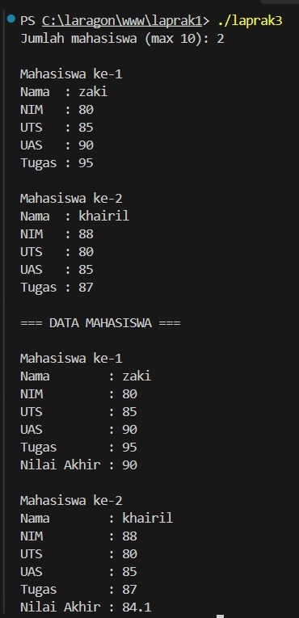
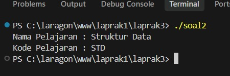
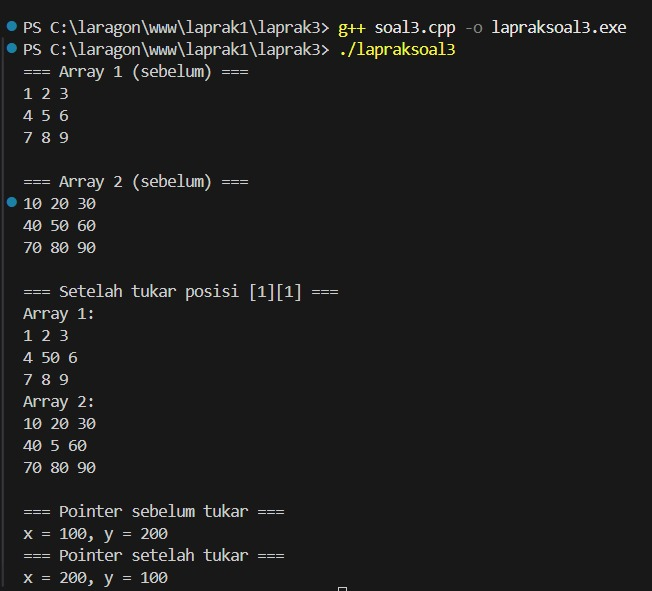

# <h1 align="center"> Modul 3 ABSTRACT DATA TYPE (ADT) (BAGIAN KETIGA) </h1>
<p align="center">Muh. Dzaky Luthfi - 109082530015</p>

## Dasar Teori

### A. Abstract Data Type ( ADT )

ADT (Abstract Data Type) adalah sebuah TYPE beserta sekumpulan PRIMITIF (operasi dasar) terhadap type tersebut. ADT yang lengkap juga menyertakan definisi invarian dari type dan aksioma yang berlaku. ADT bersifat STATIK, dan definisi type-nya boleh memuat ADT lain. Contohnya, ADT Waktu terdiri dari ADT Jam dan ADT Date, sedangkan ADT Garis terdiri dari dua ADT Point. ADT Segi4 juga bisa dibentuk dari dua Point, yaitu (Top, Left) dan (Bottom, Right).


## B. Implementasi ADT

ADT biasanya diimplementasikan menjadi **dua modul utama** dan **satu modul interface program utama (driver)**.

### 1. Definisi/Spesifikasi Type dan Primitif (Header, `.h`)

Berisi:

- **Spesifikasi type**, ditulis sesuai kaidah bahasa pemrograman yang dipakai.
- **Spesifikasi primitif**, ditulis sesuai kaidah dalam konteks prosedural:
  - **Fungsi:** nama, domain, range, dan prekondisi (jika ada).
  - **Prosedur:** initial state, final state, dan proses yang dilakukan.

### 2. Body/Realisasi Primitif (`.c`)

Berisi realisasi (implementasi) dari primitif-primitif yang sudah dispesifikasikan di header.

### 3. Driver

Modul interface berupa program utama yang memanfaatkan ADT.

## Guided 

### 1. Program Mahasiswa.h

```C++
#ifndef MAHASISWA_H_INCLUDED
#define MAHASISWA_H_INCLUDED

struct Mahasiswa{
    char nim[10];
    int nilai1, nilai2;
};

void inputMhs(Mahasiswa &m);
float rata2(Mahasiswa m);

#endif // MAHASISWA_H_INCLUDED

```
File mahasiswa.h adalah header file C++ yang berisi deklarasi untuk mengelola data mahasiswa, terdiri dari:

Header Guard (#ifndef, #define, #endif) → mencegah duplikasi saat file di-include berulang kali.

Struct Mahasiswa → tipe data bentukan dengan anggota:

nim[10] : menyimpan NIM mahasiswa

nilai1, nilai2 : menyimpan dua nilai mahasiswa

Prototipe Fungsi:

inputMhs(Mahasiswa &m) → prosedur untuk mengisi data mahasiswa (pass by reference).

rata2(Mahasiswa m) → fungsi untuk menghitung rata-rata nilai (pass by value, return float).

Kesimpulan: File ini berfungsi sebagai antarmuka (interface) yang mendeklarasikan struktur data dan fungsi terkait mahasiswa, sementara implementasinya ditulis di file .cpp terpisah. Tujuannya agar kode lebih modular dan rapi.

### 2. Program Mahasiswa.cpp

```C++
#include <iostream>
#include "mahasiswa.h"

using namespace std;

void inputMhs(Mahasiswa &m){
    cout << "Masukkan NIM: ";
    cin >> m.nim;
    cout << "Masukkan Nilai 1: ";
    cin >> m.nilai1;
    cout << "Masukkan Nilai 2: ";
    cin >> m.nilai2;
}

float rata2(Mahasiswa m){
    return float(m.nilai1 + m.nilai2) / 2.0;
}
```
File mahasiswa.cpp adalah file implementasi dari header mahasiswa.h, berisi definisi nyata dari fungsi yang telah dideklarasikan sebelumnya.

Isi File
Include & Namespace

#include <iostream> → untuk cout dan cin.

#include "mahasiswa.h" → menyertakan deklarasi struct dan prototipe fungsi.

using namespace std; → menyederhanakan penulisan.

Fungsi inputMhs(Mahasiswa &m)

Prosedur untuk menginput NIM, Nilai 1, dan Nilai 2.

Menggunakan pass by reference agar data langsung tersimpan ke variabel asli.

Fungsi rata2(Mahasiswa m)

Menghitung rata-rata dari nilai1 dan nilai2.

Menggunakan pass by value dan mengembalikan hasil bertipe float.

Kesimpulan
File ini berisi implementasi fungsi untuk input data dan perhitungan rata-rata mahasiswa. Bersama mahasiswa.h, file ini membuat program lebih modular karena deklarasi dan implementasi dipisahkan.


### 3. Program Main.cpp

```C++
#include "mahasiswa.h"
#include <iostream>

using namespace std;

int main() {
    Mahasiswa mhs;
    inputMhs(mhs);
    cout << "Rata - Rata = " << rata2 (mhs);
    return 0;
}

```
Program ini adalah aplikasi sederhana pengolahan data mahasiswa yang ditulis dalam C++ dengan pendekatan modular (memisahkan deklarasi, implementasi, dan program utama ke dalam tiga file berbeda). Program menerima input NIM dan dua nilai dari pengguna, lalu menghitung dan menampilkan rata-ratanya.


## Unguided 

### 1. Buat program yang dapat menyimpan data mahasiswa (max. 10) ke dalam sebuah array dengan field nama, nim, uts, uas, tugas, dan nilai akhir. Nilai akhir diperoleh dari FUNGSI dengan rumus 0.3*uts+0.4*uas+0.3*tugas.  

```C++
#include <iostream>
using namespace std;

struct Mahasiswa {
    string nama, nim;
    float uts, uas, tugas, nilaiAkhir;
};


float hitungNilai(float uts, float uas, float tugas) {
    return 0.3 * uts + 0.4 * uas + 0.3 * tugas;
}

int main() {
    Mahasiswa mhs[10];
    int n;

    cout << "Jumlah mahasiswa (max 10): ";
    cin >> n;
    cin.ignore();


    for (int i = 0; i < n; i++) {
        cout << "\nMahasiswa ke-" << i+1 << endl;
        cout << "Nama  : "; getline(cin, mhs[i].nama);
        cout << "NIM   : "; getline(cin, mhs[i].nim);
        cout << "UTS   : "; cin >> mhs[i].uts;
        cout << "UAS   : "; cin >> mhs[i].uas;
        cout << "Tugas : "; cin >> mhs[i].tugas;
        cin.ignore();

        mhs[i].nilaiAkhir = hitungNilai(mhs[i].uts, mhs[i].uas, mhs[i].tugas);
    }


    cout << "\n=== DATA MAHASISWA ===\n";
    for (int i = 0; i < n; i++) {
        cout << "\nMahasiswa ke-" << i+1 << endl;
        cout << "Nama        : " << mhs[i].nama << endl;
        cout << "NIM         : " << mhs[i].nim << endl;
        cout << "UTS         : " << mhs[i].uts << endl;
        cout << "UAS         : " << mhs[i].uas << endl;
        cout << "Tugas       : " << mhs[i].tugas << endl;
        cout << "Nilai Akhir : " << mhs[i].nilaiAkhir << endl;
    }

    return 0;
}
```
### Output Unguided 1 :

##### Output 1


- Program ini adalah program sederhana untuk mengelola data mahasiswa menggunakan array of struct di C++. Program menerima input data maksimal 10 mahasiswa, menghitung nilai akhir melalui fungsi, lalu menampilkan seluruh data.

- Tujuan Program
Menyimpan data mahasiswa (nama, NIM, UTS, UAS, tugas, nilai akhir)

Menghitung nilai akhir dengan rumus: 0.3*UTS + 0.4*UAS + 0.3*Tugas

Menampilkan seluruh data yang telah diinput

### 2. Buatlah ADT pelajaran sebagai berikut di dalam file “pelajaran.h”: Type pelajaran <  namaMapel : string  kodeMapel : string >  function create_pelajaran( namapel : string,     kodepel : string ) → pelajaran procedure tampil_pelajaran( input pel : pelajaran ) Buatlah implementasi ADT pelajaran pada file “pelajaran.cpp” Cobalah hasil implementasi ADT pada file “main.cpp” using namespace std; int main(){  string namapel = "Struktur Data";  string kodepel = "STD";  pelajaran pel = create_pelajaran(namapel,kodepel);  tampil_pelajaran(pel);    return 0; }  

```C++
#pelajaran.h
#ifndef PELAJARAN_H_INCLUDED
#define PELAJARAN_H_INCLUDED

#include <iostream>
using namespace std;


struct pelajaran {
    string namaMapel;
    string kodeMapel;
};

pelajaran create_pelajaran(string namapel, string kodepel);


void tampil_pelajaran(pelajaran pel);

#endif // PELAJARAN_H_INCLUDED
```
```C++
#pelajaran.cpp
#include "pelajaran.h"

pelajaran create_pelajaran(string namapel, string kodepel) {
    pelajaran pel;
    pel.namaMapel = namapel;
    pel.kodeMapel = kodepel;
    return pel;
}

void tampil_pelajaran(pelajaran pel) {
    cout << "Nama Pelajaran : " << pel.namaMapel << endl;
    cout << "Kode Pelajaran : " << pel.kodeMapel << endl;
}
```
```C++
#main.cpp
#include "pelajaran.h"

using namespace std;

int main() {
    string namapel = "Struktur Data";
    string kodepel = "STD";

    pelajaran pel = create_pelajaran(namapel, kodepel);
    tampil_pelajaran(pel);

    return 0;
}
```
### Output Unguided 2 :

##### Output 2


Program ini adalah implementasi ADT (Abstract Data Type) Pelajaran dalam C++ yang dipisah menjadi 3 file modular: pelajaran.h (header), pelajaran.cpp (implementasi), dan main.cpp (program utama).

Pada file pelajaran.h, terdapat header guard (#ifndef, #define, #endif) untuk mencegah duplikasi deklarasi, include <iostream> dan using namespace std;, serta deklarasi struct pelajaran dengan dua field yaitu namaMapel dan kodeMapel. Selain itu, dideklarasikan dua prototipe fungsi: create_pelajaran() yang mengembalikan objek pelajaran, dan tampil_pelajaran() yang bertipe void.

Pada file pelajaran.cpp, diimplementasikan fungsi create_pelajaran() yang menerima parameter namapel dan kodepel, mengisinya ke dalam struct pelajaran, lalu mengembalikan objek tersebut. Selanjutnya, prosedur tampil_pelajaran() menampilkan isi field namaMapel dan kodeMapel menggunakan cout.

Pada file main.cpp, program utama menyiapkan variabel namapel = "Struktur Data" dan kodepel = "STD", lalu memanggil create_pelajaran() untuk membuat objek pel, dan menampilkannya dengan tampil_pelajaran(pel). Output yang dihasilkan adalah nama pelajaran "Struktur Data" dan kode "STD".

Program ini menerapkan konsep ADT, modular programming, header guard, function return value, procedure void, dan pass by value. Kompilasinya harus menyertakan kedua file .cpp, misalnya g++ main.cpp pelajaran.cpp -o soal2.exe, karena deklarasi dan implementasi dipisah. Pendekatan ini membuat kode lebih rapi, reusable, dan menjadi dasar sebelum mempelajari OOP di C++.


### 3. Buatlah program dengan ketentuan : 
- 2 buah array 2D integer berukuran 3x3 dan 2 buah pointer integer 
- fungsi/prosedur yang menampilkan isi sebuah array integer 2D 
- fungsi/prosedur yang akan menukarkan isi dari 2 array integer 2D pada posisi tertentu 
- fungsi/prosedur yang akan menukarkan isi dari variabel yang ditunjuk oleh 2 buah pointer 
```C++
#include <iostream>
using namespace std;

void tampilArray(int arr[3][3]) {
    for (int i = 0; i < 3; i++) {
        for (int j = 0; j < 3; j++) {
            cout << arr[i][j] << " ";
        }
        cout << endl;
    }
}

void tukarArray(int arr1[3][3], int arr2[3][3], int baris, int kolom) {
    int temp = arr1[baris][kolom];
    arr1[baris][kolom] = arr2[baris][kolom];
    arr2[baris][kolom] = temp;
}

void tukarPointer(int *a, int *b) {
    int temp = *a;
    *a = *b;
    *b = temp;
}

int main() {
    int arr1[3][3] = {
        {1, 2, 3},
        {4, 5, 6},
        {7, 8, 9}
    };
    int arr2[3][3] = {
        {10, 20, 30},
        {40, 50, 60},
        {70, 80, 90}
    };

    int x = 100, y = 200;
    int *p1 = &x;
    int *p2 = &y;

    cout << "=== Array 1 (sebelum) ===\n";
    tampilArray(arr1);
    cout << "\n=== Array 2 (sebelum) ===\n";
    tampilArray(arr2);

    tukarArray(arr1, arr2, 1, 1);

    cout << "\n=== Setelah tukar posisi [1][1] ===\n";
    cout << "Array 1:\n";
    tampilArray(arr1);
    cout << "Array 2:\n";
    tampilArray(arr2);

    cout << "\n=== Pointer sebelum tukar ===\n";
    cout << "x = " << *p1 << ", y = " << *p2 << endl;

    tukarPointer(p1, p2);

    cout << "=== Pointer setelah tukar ===\n";
    cout << "x = " << *p1 << ", y = " << *p2 << endl;

    return 0;
}
```
### Output Unguided 3 :

##### Output 3


Program ini dibuat sesuai ketentuan soal dengan menggunakan dua array 2D integer 3x3 (arr1 dan arr2), dua pointer integer (p1 dan p2) yang menunjuk ke variabel x dan y, serta tiga prosedur utama.

Prosedur tampilArray() berfungsi menampilkan isi array 2D menggunakan nested loop. Prosedur tukarArray() menukar isi dua array pada posisi tertentu (baris dan kolom) menggunakan variabel sementara. Prosedur tukarPointer() menukar nilai dua variabel yang ditunjuk pointer menggunakan dereference (*a dan *b).

Di main(), program menampilkan array sebelum ditukar, memanggil tukarArray(arr1, arr2, 1, 1) untuk menukar posisi [1][1], menampilkan hasilnya, lalu memanggil tukarPointer(p1, p2) untuk menukar isi x dan y melalui pointer. Program ini menerapkan konsep array 2D, pointer, pass by pointer, dan prosedur dalam C++.


## Kesimpulan
Modul 3 ini membahas konsep Abstract Data Type (ADT) sebagai sebuah tipe data beserta sekumpulan operasi dasar (primitif) yang bekerja padanya, di mana ADT bersifat statik dan dapat tersusun dari ADT lain. Implementasi ADT dalam C++ dilakukan secara modular dengan memisahkan kode menjadi tiga modul utama, yaitu file header (.h) yang berisi definisi tipe dan spesifikasi primitif, file implementasi (.cpp) yang berisi realisasi dari primitif tersebut, serta file driver (main.cpp) sebagai antarmuka program utama yang memanfaatkan ADT. Pemisahan ini membuat kode lebih rapi, terstruktur, reusable, dan mudah dipelihara, serta menjadi fondasi penting sebelum mempelajari konsep Object Oriented Programming (OOP).

Pada bagian Guided, dipraktikkan pembuatan ADT sederhana untuk mengelola data mahasiswa melalui tiga file, yaitu mahasiswa.h (deklarasi struct dan prototipe fungsi), mahasiswa.cpp (implementasi fungsi inputMhs() dengan pass by reference dan rata2() dengan pass by value), serta main.cpp sebagai driver yang memanggil kedua fungsi tersebut. Ketiga file ini harus dikompilasi bersamaan, misalnya g++ main.cpp mahasiswa.cpp -o program.exe, karena deklarasi dan implementasi berada di file terpisah.

Pada bagian Unguided, diterapkan tiga latihan yang memperkuat pemahaman konsep ADT dan struktur data dasar. Latihan pertama membuat program penyimpanan data maksimal 10 mahasiswa menggunakan array of struct dengan field nama, NIM, UTS, UAS, tugas, dan nilai akhir, di mana nilai akhir dihitung melalui sebuah fungsi dengan rumus 0.3*UTS + 0.4*UAS + 0.3*Tugas. Latihan kedua mengimplementasikan ADT Pelajaran dengan dua field (namaMapel dan kodeMapel) serta dua primitif berupa fungsi create_pelajaran() yang mengembalikan objek pelajaran dan prosedur tampil_pelajaran() yang menampilkan isinya, yang dipisah ke dalam file pelajaran.h, pelajaran.cpp, dan main.cpp. Latihan ketiga membuat program yang melibatkan dua array 2D integer 3x3, dua pointer integer, serta tiga prosedur, yaitu tampilArray() untuk menampilkan isi array 2D, tukarArray() untuk menukar isi dua array pada posisi tertentu, dan tukarPointer() untuk menukar isi dua variabel yang ditunjuk pointer melalui dereference.

Secara keseluruhan, modul ini menegaskan bahwa ADT adalah cara berpikir untuk membungkus data dan operasinya menjadi satu kesatuan, sehingga program menjadi lebih modular dan tidak ada kode yang berulang. Konsep array, pointer, fungsi, prosedur, pass by value, pass by pointer, dan pass by reference yang telah dipelajari sebelumnya menjadi dasar penting dalam mengimplementasikan ADT, dan seluruh materi pada modul ini merupakan pondasi krusial sebelum melangkah ke pemrograman berorientasi objek yang lebih kompleks.
## Referensi
[1] Malik, D. S. (2010). *Data Structures Using C++* (2nd ed.). Boston: Cengage Learning.
<br>[2] Drozdek, A. (2013). *Data Structures and Algorithms in C++* (4th ed.). Boston: Cengage Learning.
<br>...
